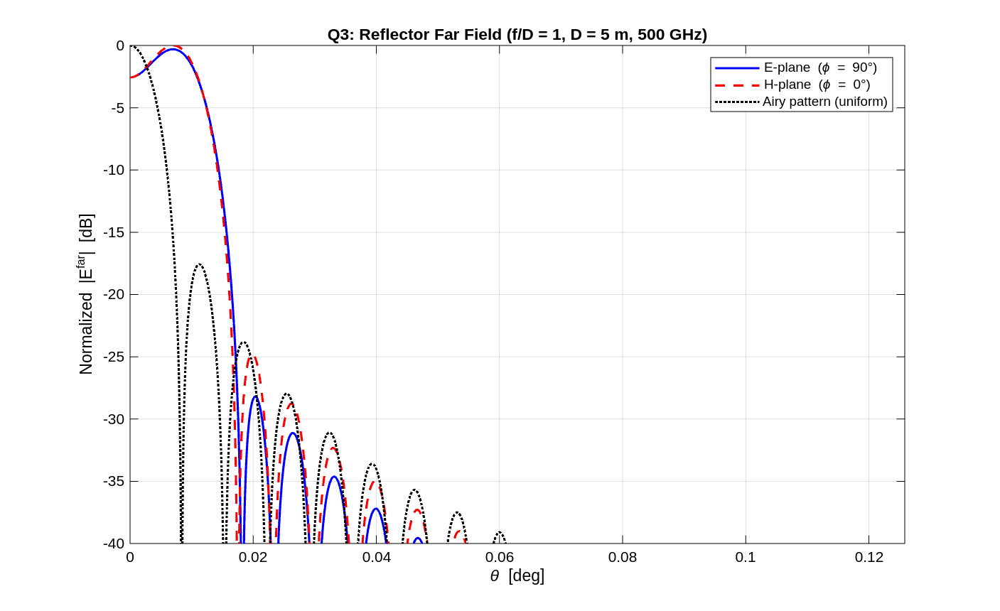
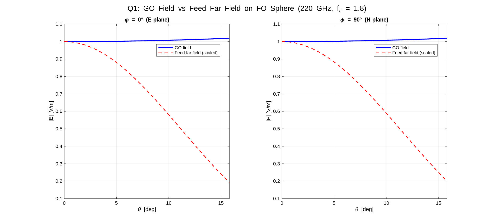
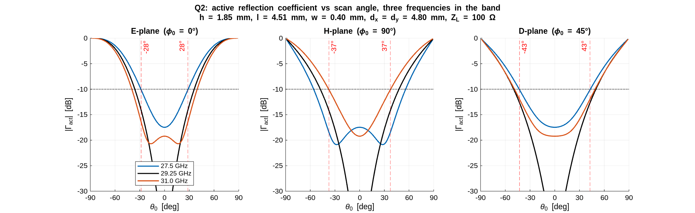

# EE4725 Quasi-Optical Systems

Antenna and quasi-optics coursework at TU Delft (Microelectronics), built on one common tool: a free-space spectral Green's function (`EJ_SGF.m`) used to compute the fields radiated by electric current distributions. Every assignment reuses that core to analyze a different quasi-optical component, from elementary sources up to a steerable Ka-band array. Each `instruction*/` folder has the assignment brief, the submitted report PDF, MATLAB, and generated figures.

## Assignments

### 1. Spectral Green's function and elementary sources
Implemented the free-space spectral Green's function and used it to compute the far field of an elementary source and a dipole, directivity versus frequency, and the effect of a ground plane at height h.

### 2. Parabolic reflector antenna
Feed far field to aperture currents to secondary far field for an f/D = 1, 500 GHz reflector, including aperture efficiency, spillover, and gain. The reflector pattern matches the ideal Airy pattern near boresight.

### 3. Lens antenna
Elliptical lens analysis: feed pattern, Fresnel transmission at flat and lens surfaces, aperture currents, and the resulting lens far field and gain.

### 4. Focal-plane array and Gaussian optics
Geometrical-optics field on the focal sphere versus the feed far field, receiver-versus-transmitter analysis, and displaced-feed beam scanning with different focal-plane sampling schemes.

### 5. Infinite array active impedance
Active input impedance of an infinite dipole array versus scan angle using method-of-moments basis functions (`basis_long.m`, `basis_trans.m`, `Z_active.m`), plus the grating-lobe diagram.

### 6. Frequency-selective surfaces and pattern control
Active element pattern, windowed excitation to shape the pattern, and grating-lobe suppression with a frequency-selective surface (`Z_FSS.m`, `v_FSS.m`).

## Final project: Ka-band satcom dipole array

Design and defence of a printed-dipole phased array with a backing reflector for aircraft-to-satellite links over 27.5 to 31 GHz (12% bandwidth). The array must scan electronically while keeping the active reflection coefficient and half-power beamwidth in spec across the band.

`final/` holds the design sweep, scan analysis, HPBW study, the report, the defence slides, and a study guide covering the design rationale and likely defence questions.

## Repository layout

| Path | Contents |
| --- | --- |
| `instruction1/` to `instruction6/` | Per-assignment brief, MATLAB, figures, report |
| `final/` | Ka-band array design, report, presentation, study guide |
| `Basic MATLAB coding (QO 2023)/` | Warm-up scripts (coordinate transforms, validation) |

Shared across assignments: `EJ_SGF.m` (spectral Green's function), `set_plot_defaults.m`, and per-topic solver functions. All MATLAB, no extra toolboxes required.
