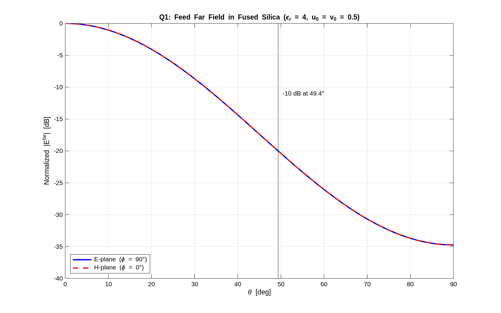
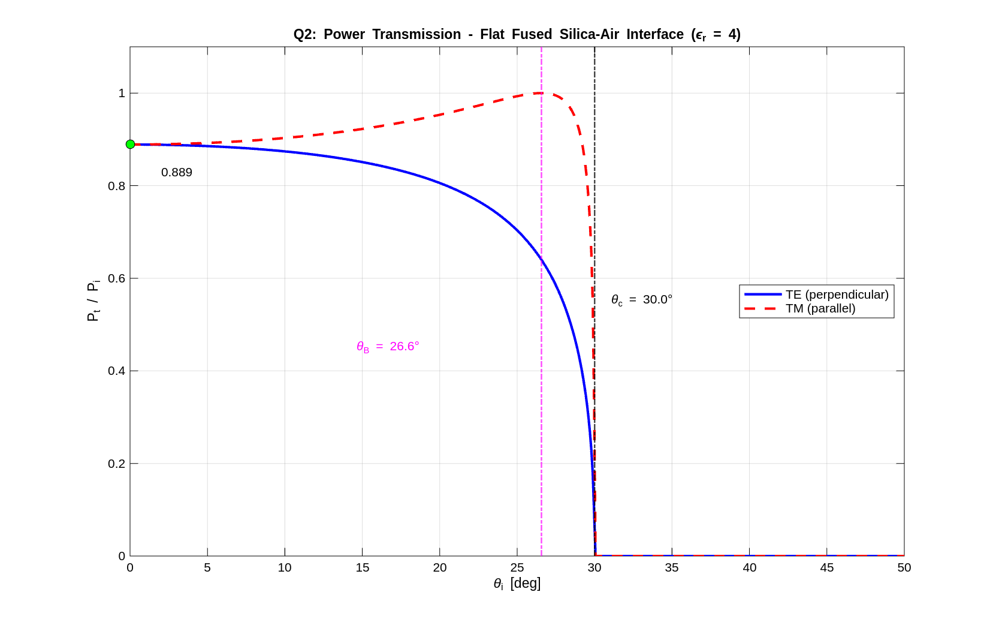
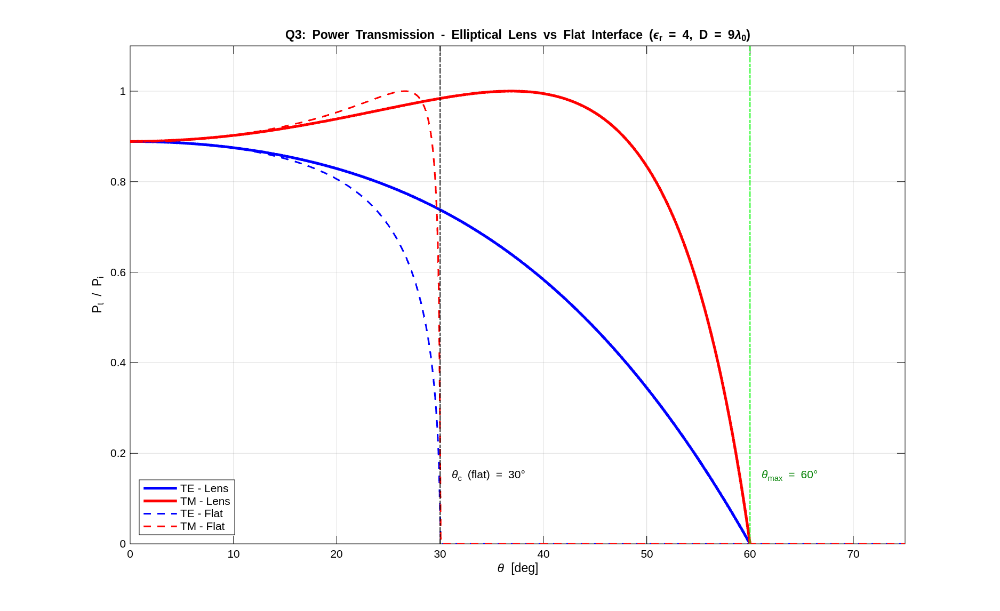
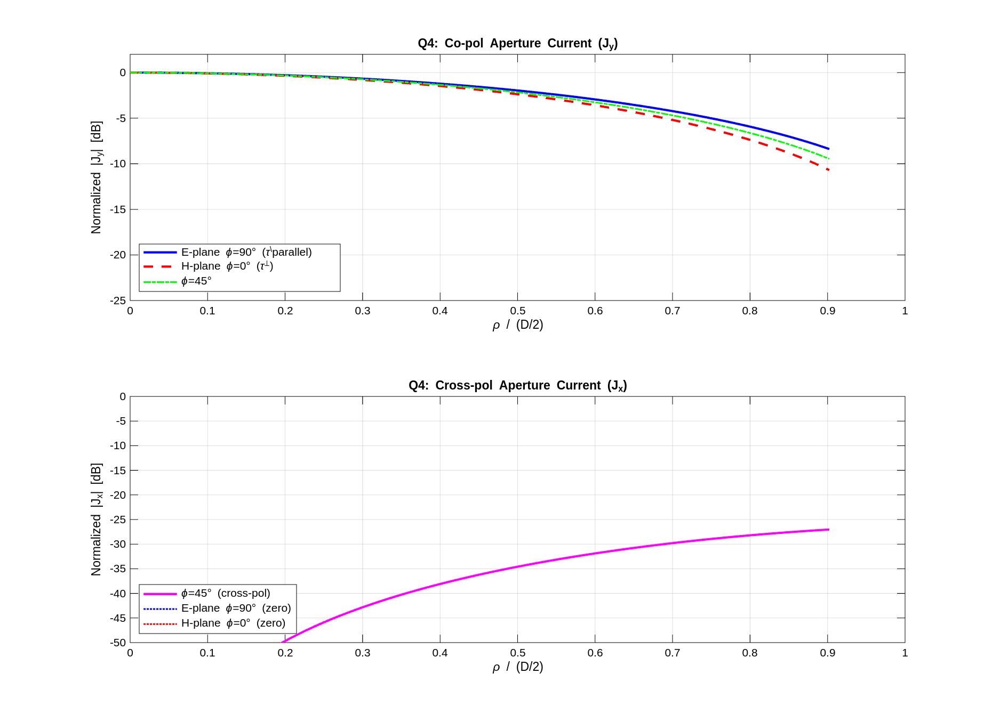
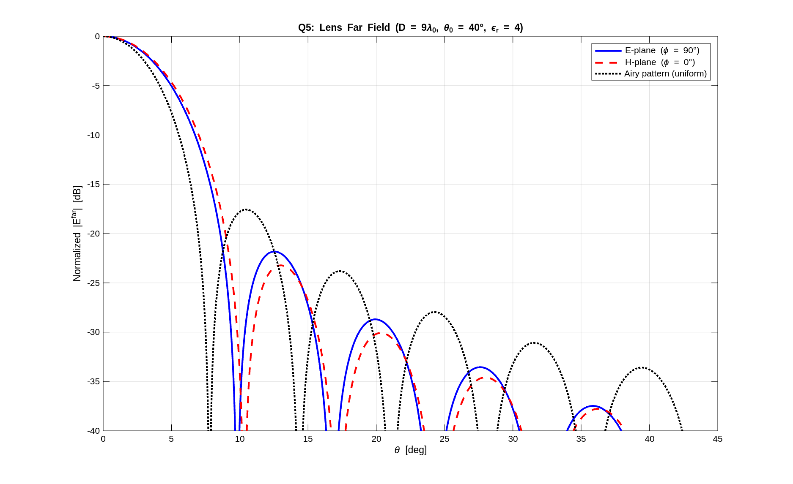

# EE4725 - Quasi Optical Systems 2026
## Assignment 3: Lens Antenna
**Daniel Tyukov** | Student Number: 5714699 | Microelectronics, TU Delft | March 2026

---

## System Parameters

The system under analysis is an elliptical dielectric lens antenna with the following parameters:

- Operating frequency: $f = 200\,\text{GHz}$, wavelength $\lambda_0 = c/f = 1.5\,\text{mm}$, wavenumber $k_0 = 2\pi/\lambda_0$
- Dielectric material: fused silica, $\varepsilon_r = 4$, $k_d = \sqrt{\varepsilon_r}\,k_0 = 2k_0$
- Feed: planar antenna at the lower focal point of an elliptical lens, with Gaussian far field in infinite dielectric:

$$\vec{E}^a_{far}(\theta,\phi) = e^{-\left[\left(\frac{u}{u_0}\right)^2 + \left(\frac{v}{v_0}\right)^2\right]} \left(\sin\phi\,\hat{\theta} + \cos\phi\,\hat{\phi}\right) \frac{e^{-jk_d r}}{r}$$

where $u = \sin\theta\cos\phi$, $v = \sin\theta\sin\phi$, and $u_0,v_0$ control directivity in the principal planes.

- Elliptical lens: eccentricity $e = 1/\sqrt{\varepsilon_r} = 0.5$, polar equation from lower focus:

$$r(\theta) = \frac{a(1-e^2)}{1 - e\cos\theta}$$

---

## Question 1: Feed Far Field ($\varepsilon_r = 4$, $u_0 = v_0 = 0.5$)

**Script:** `matlab/Q1_feed_farfield.m`

The Gaussian feed pattern in the two principal planes reduces to:

- E-plane ($\phi = 90°$): $|\vec{E}| = \exp\!\left(-\sin^2\!\theta / v_0^2\right)$, purely $\hat{\theta}$-polarized
- H-plane ($\phi = 0°$): $|\vec{E}| = \exp\!\left(-\sin^2\!\theta / u_0^2\right)$, purely $\hat{\phi}$-polarized

Since $u_0 = v_0 = 0.5$, both planes yield identical patterns.

*Figure 1: Normalized far-field pattern of the Gaussian feed in infinite fused silica ($\varepsilon_r = 4$, $u_0 = v_0 = 0.5$, 200 GHz). E-plane and H-plane curves overlap due to circular symmetry ($u_0 = v_0$).*

Observations from Figure 1:

- The pattern is a smooth Gaussian roll-off with no sidelobes, with $-3\,\text{dB}$ half-angle at $24.6°$ and $-10\,\text{dB}$ half-angle at $49.4°$.
- The E-plane and H-plane curves are identical, confirming the circular symmetry of the feed for $u_0 = v_0$.
- The polarization $(\sin\phi\,\hat{\theta} + \cos\phi\,\hat{\phi})$ is a Huygens-type source: in the E-plane it is purely $\hat{\theta}$-polarized, in the H-plane purely $\hat{\phi}$-polarized. This ensures the co-pol pattern is the same in both planes. This symmetry will be broken by the Fresnel transmission coefficients when the lens is introduced (Q4, Q5).

---

## Question 2: Fresnel Transmission Coefficients — Flat Interface

**Script:** `matlab/Q2_fresnel_flat.m`

The Fresnel transmission coefficients for a flat fused silica-to-air interface are:

$$\tau^\perp = \frac{2\zeta_0\cos\theta_i}{\zeta_0\cos\theta_i + \zeta_d\cos\theta_t}, \qquad \tau^\parallel = \frac{2\zeta_0\cos\theta_i}{\zeta_0\cos\theta_t + \zeta_d\cos\theta_i}$$

where $\zeta_d = \zeta_0/\sqrt{\varepsilon_r}$ and Snell's law gives $\sqrt{\varepsilon_r}\sin\theta_i = \sin\theta_t$. The power transmission ratio is $P_t/P_i = 1 - |\Gamma|^2$.

*Figure 2: Power transmission ratio $P_t/P_i$ vs. incidence angle for a flat fused silica-air interface ($\varepsilon_r = 4$), for TE and TM polarizations.*

Observations from Figure 2:

1. **Normal incidence ($\theta_i = 0°$):** $P_t/P_i = 4n/(1+n)^2 = 8/9 = 0.889$ for both TE and TM ($n = \sqrt{\varepsilon_r} = 2$). About 11.1% of power is reflected.

2. **Brewster angle (TM only):** $\theta_B = \arctan(1/\sqrt{\varepsilon_r}) = 26.6°$. At this angle, $\Gamma^\parallel = 0$ and TM transmission is complete ($P_t/P_i = 1$). No corresponding angle exists for TE polarization, since the TE reflection coefficient $\Gamma^\perp$ is monotonically increasing.

3. **Critical angle:** $\theta_c = \arcsin(1/\sqrt{\varepsilon_r}) = 30.0°$. Beyond this angle, total internal reflection occurs for both polarizations: $\sin\theta_t > 1$, $\theta_t$ becomes complex, and all power is reflected.

4. **Between Brewster and critical (TM):** $P_t/P_i$ drops from 1.0 back to 0 over a narrow $3.4°$ range, demonstrating the rapid transition to total internal reflection.

---

## Question 3: Fresnel Transmission Coefficients — Elliptical Lens ($D = 9\lambda_0$)

**Script:** `matlab/Q3_fresnel_lens.m`

On the elliptical lens surface, the local incidence angle at each point depends on the elevation angle $\theta$ from the lower focus via:

$$\cos\theta_i = \frac{1 - e\cos\theta}{\sqrt{1 + e^2 - 2e\cos\theta}}$$

The computed lens parameters are: $e = 0.500$, $a = 7.794\,\text{mm}$, $b = 6.750\,\text{mm}$, $h = 11.691\,\text{mm}$, and the maximum lens angle is $\theta_{\max} = \arctan(b/(ea)) = 60.0°$.

*Figure 3: Power transmission ratio vs. elevation angle $\theta$ for the elliptical lens (solid) compared with the flat interface (dashed). The lens extends significant transmission well beyond the flat-interface critical angle of 30°.*

Observations from Figure 3:

- At the top of the lens ($\theta = 0$), $\theta_i = 0°$ and the transmission equals the flat normal-incidence value of 0.889 for both polarizations.
- The elliptical curvature causes the local incidence angle to grow much more slowly than $\theta$ itself. For example, at $\theta = 40°$ (the truncation angle used in Q4--Q6), the local $\theta_i \approx 17°$, still well below the critical angle.
- The flat interface (dashed curves) shows total internal reflection at $\theta_i = 30°$, but the lens maintains significant transmission well beyond $\theta = 30°$. TM transmission (solid red) stays above 0.9 up to $\theta \approx 50°$ due to the Brewster effect on the curved surface.
- At $\theta_{\max} = 60°$, the local incidence angle reaches exactly $30°$ (the critical angle), and both polarizations drop to zero. This is a fundamental property of the elliptical lens with $e = 1/\sqrt{\varepsilon_r}$: the maximum lens angle always maps to the critical angle.
- The key advantage of the elliptical geometry is clear: it extends the range of high transmission to much larger elevation angles compared to a flat interface, enabling wider feeds while maintaining good power transfer.

---

## Question 4: Aperture Current Distribution ($\varepsilon_r = 4$, $D = 9\lambda_0$, $\theta_0 = 40°$, $u_0 = v_0 = 0.5$)

**Script:** `matlab/Q4_aperture_currents.m`

The equivalent aperture currents are computed using the GO/PO method. The elliptical lens provides spreading factor $S = 1$ (exact) and uniform phase $k_d r + k_0 r' = k_d a(1+e)$ across the aperture. Since the equivalent electric and magnetic currents are orthogonal with the same distribution, the far field can be computed using only $\vec{J}_s$ with twice the amplitude:

$$J_{s,x} = -\frac{2}{\zeta_0}\frac{1}{r}\left[\tau^\parallel E_i^\theta\cos\phi - \tau^\perp E_i^\phi\sin\phi\right]$$

$$J_{s,y} = -\frac{2}{\zeta_0}\frac{1}{r}\left[\tau^\parallel E_i^\theta\sin\phi + \tau^\perp E_i^\phi\cos\phi\right]$$

For the Huygens feed, $E_i^\theta = \sin\phi\cdot G(\theta)$ and $E_i^\phi = \cos\phi\cdot G(\theta)$, where $G(\theta)$ is the Gaussian envelope. This simplifies the currents in the principal planes:
- E-plane ($\phi = 90°$): $J_y \propto \tau^\parallel \cdot G(\theta)/r$, $J_x = 0$
- H-plane ($\phi = 0°$): $J_y \propto \tau^\perp \cdot G(\theta)/r$, $J_x = 0$

*Figure 4: Normalized aperture current distribution. Top: co-pol component $J_y$ in the E-plane ($\tau^\parallel$, blue), H-plane ($\tau^\perp$, red), and $\phi = 45°$ (green). Bottom: cross-pol component $J_x$ at $\phi = 45°$ (magenta); $J_x$ is identically zero in the principal planes.*

Observations from Figure 4:

- **Co-pol ($J_y$):** The E-plane (governed by $\tau^\parallel$, TM) shows an edge taper of $-8.4\,\text{dB}$, while the H-plane (governed by $\tau^\perp$, TE) shows a steeper taper of $-10.7\,\text{dB}$. The TM coefficient benefits from the Brewster effect, maintaining higher transmission at oblique angles, hence the gentler taper in the E-plane.

- **Cross-pol ($J_x$):** In the principal planes ($\phi = 0°$ and $90°$), the cross-pol is identically zero because the Huygens polarization aligns perfectly with the TE/TM decomposition axes. At $\phi = 45°$, cross-pol appears at $-27.0\,\text{dB}$ below co-pol, arising from the mismatch $\tau^\parallel \neq \tau^\perp$.

- **Effect of feed pattern (Q1):** The Gaussian taper dominates the amplitude variation, providing a smooth roll-off. At $\theta_0 = 40°$, the feed itself is at about $-5\,\text{dB}$, which combined with the Fresnel coefficient variation and $1/r$ geometric taper produces the total 8–11 dB edge taper.

- **Effect of transmission coefficients:** Without Fresnel effects ($\tau^\perp = \tau^\parallel$), the aperture distribution would be perfectly circularly symmetric. The E/H asymmetry and the cross-pol generation are entirely due to $\tau^\perp \neq \tau^\parallel$.

---

## Question 5: Lens Far Field

**Script:** `matlab/Q5_lens_farfield.m`

The lens far field is computed via the free-space spectral Green's function applied to the aperture currents:

$$\vec{E}^{far}_{lens}(\vec{r}) = jk_{zs}\,\tilde{\bar{G}}^{ej}_{fs}(k_{xs},k_{ys})\,\tilde{\vec{J}}_s(k_{xs},k_{ys})\,\frac{e^{-jk_0 r}}{2\pi r}$$

where $\tilde{\vec{J}}_s$ is the 2D Fourier transform of the aperture currents, evaluated at the stationary phase point $(k_{xs},k_{ys}) = k_0(\sin\theta\cos\phi, \sin\theta\sin\phi)$. The computation uses a $301 \times 301$ aperture grid.

*Figure 5: Normalized lens far-field pattern in the E-plane (blue) and H-plane (red), compared with the Airy pattern (black dotted) for a uniformly illuminated circular aperture of diameter $D = 9\lambda_0$.*

Observations from Figure 5:

1. **Wider main beam:** The first null of the lens pattern is at $\sim 9°$–$10°$, compared to $\sim 8°$ for the Airy pattern. The Gaussian + Fresnel amplitude taper reduces the effective aperture size, broadening the main beam.

2. **Lower sidelobes:** The first sidelobe is approximately $-22\,\text{dB}$ (E-plane) and $-26\,\text{dB}$ (H-plane), well below the Airy first sidelobe at $-17.6\,\text{dB}$. The smooth taper acts as a window function that suppresses sidelobes at the cost of a wider main beam.

3. **E/H plane asymmetry:** The H-plane shows deeper nulls and lower sidelobes than the E-plane. This asymmetry is governed by:
   - **Primary cause:** $\tau^\perp \neq \tau^\parallel$. The E-plane co-pol uses $\tau^\parallel$ (TM, gentler taper → narrower beam, higher sidelobes), while the H-plane uses $\tau^\perp$ (TE, steeper taper → wider beam, lower sidelobes). This is consistent with the aperture current asymmetry observed in Q4.
   - **Secondary cause:** The free-space SGF introduces a $\cos\theta$ factor difference between $E_\theta$ and $E_\phi$ projections.

---

## Question 6: Directivity and Gain

**Script:** `matlab/Q6_directivity_gain.m`

The directivity is computed from the far-field radiation intensity integrated over the upper hemisphere:

$$D = \frac{4\pi\,U_{\max}}{P_{rad}}, \qquad U(\theta,\phi) = |E_\theta|^2 + |E_\phi|^2$$

The gain accounts for power lost to spillover and Fresnel reflection:

$$G = D \cdot \eta_r, \qquad \eta_r = \frac{P^{lens}_{rad}}{P^{feed}_{rad}}$$

where $\eta_r$ includes both spillover losses (feed power missing the lens) and reflection losses (Fresnel reflection at the lens surface).

| Parameter | Value |
|---|---|
| $D_{\max}$ (uniform aperture, $(\pi D/\lambda_0)^2$) | 29.0 dBi |
| Directivity $D$ | 27.8 dBi |
| Gain $G = D \cdot \eta_r$ | 27.0 dBi |
| Spillover efficiency $\eta_s$ | 94.8% |
| Reflection efficiency $\eta_{refl}$ | 87.8% |
| Total $\eta_r = \eta_s \cdot \eta_{refl}$ | 83.3% |
| Aperture efficiency $D/D_{\max}$ | 74.9% |

*Table 1: Directivity, gain, and efficiency breakdown for the lens antenna of Q4.*

The directivity is 1.2 dB below $D_{\max}$, due to the amplitude taper from the Gaussian feed and the Fresnel coefficient variation. The gain is a further 0.8 dB below the directivity due to the combined spillover and reflection losses.

The high spillover efficiency (94.8%) is expected: the feed $-10\,\text{dB}$ angle ($49.4°$) is well beyond the lens truncation angle ($40°$), so most feed power is intercepted by the lens. The reflection efficiency (87.8%) represents the average Fresnel loss across the lens surface, which is moderate for fused silica ($\varepsilon_r = 4$). The overall aperture efficiency of 74.9% is a good result for an unmatched dielectric lens, and could be improved further with a quarter-wave matching layer ($\varepsilon_{rm} = \sqrt{\varepsilon_r} = 2$).
